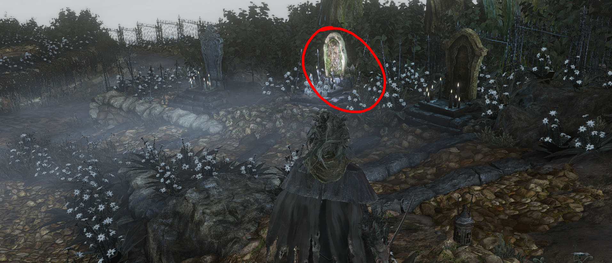

# Bloodborne Autofarm Script
Assumes user is emulating BB on Windows using `ShadPS4`.

## What?
* Simple autofarming script for farming Blood Echoes using the `cummmfpk` chalice. It simulates playing by creating key-press events.
* After 95 runs of the dungeon, will navigate back to the Hunter's Dream to re-stock `Blood Hunter's Marks`, before returning to the dungeon and starting the loop all over again.

## How?
### Setup
* `ShadPS4` default KBM controls.
* Make sure chalice has been created at the following chalice dungeon gravestone.

* 99 `Blood Hunter's Marks` equipped and the actively selected `Quick Item`.
* At first lantern in `cummmfpk` dungeon.
* Use 1 `Blood Hunter's Mark` to get correct player and camera placement.

### Using Script
* Administrator cmd/pwsh instance.
* Run script, e.g. `python3 .\autofarm.py`
* Make sure BB is the active window on desktop. After 6 seconds (from running the script), the farming loop will start.

## Dependencies
- [pynput](https://github.com/moses-palmer/pynput) - LGPL-3.0
